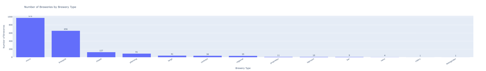
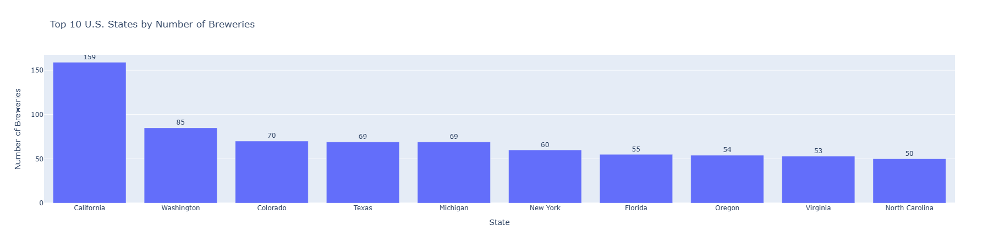
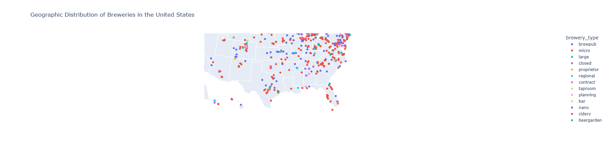

# How Do Brewery Characteristics Vary Across the United States?

## Introduction

The craft brewing industry has grown rapidly across the United States over the past several decades. While breweries can be found throughout the country, they differ in both their business models and their geographic distribution. Understanding these patterns provides insight into how the brewing industry is organised and where breweries are most heavily concentrated.

This project uses data collected from the Open Brewery DB API to examine brewery characteristics across the United States. The analysis focuses on three questions:

- Which brewery types are most common?
- Which states contain the largest numbers of breweries?
- Where are breweries geographically concentrated?

The following sections summarise the strongest findings from the analysis.

---

## Finding 1: Micro Breweries Dominate the Industry**

Among the 1,380 U.S. breweries in the dataset, micro breweries are the most common type (703, about 51%), followed by brewpubs (398, about 29%). Together they make up roughly 80% of records, and every other category has 91 or fewer. The dataset also includes 91 breweries in planning and 68 that have closed.

This finding shows that the U.S. brewing industry is strongly concentrated in a small number of brewery types rather than being evenly distributed across business models.

## Finding 2: Brewery Activity Is Concentrated in a Small Number of States**

State counts in this sample. California has the most records (159, about 12% of U.S. records), followed by Washington (85), Colorado (70), Texas (69), and Michigan (69). The top 10 states hold 52% of U.S. records.

These results show that brewery activity is concentrated in a relatively small number of states rather than being evenly distributed across the United States.

## Finding 3: Breweries Form Clear Regional Clusters

Mapping brewery locations shows that breweries tend to cluster rather than being spread evenly across the United States. The largest concentrations appear along the West Coast, throughout the Northeast, and around major metropolitan areas.

These geographic clusters reinforce the state-level analysis by showing that breweries are concentrated not only within certain states but also within specific regions of those states.

The dataset contains 2,000 records from the first 10 alphabetical pages returned by the Open Brewery DB API, with brewery names ranging from symbols through “Br.” Because these records are not a random sample of all U.S. breweries, the findings describe patterns in this dataset rather than the entire U.S. brewing industry.

## Conclusion

This project explored how brewery characteristics vary across the United States using data collected from the Open Brewery DB API.

Three key findings emerged. First, micro breweries dominate the industry. Second, brewery activity is concentrated in a relatively small number of states, with California containing the highest number of breweries in the dataset. Finally, brewery locations form clear regional clusters that highlight areas where breweries are especially common.

Together, these findings demonstrate that the U.S. brewing industry is characterised by both business-type concentration and geographic clustering rather than an even distribution across the country.